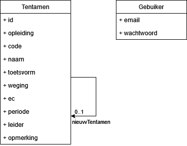
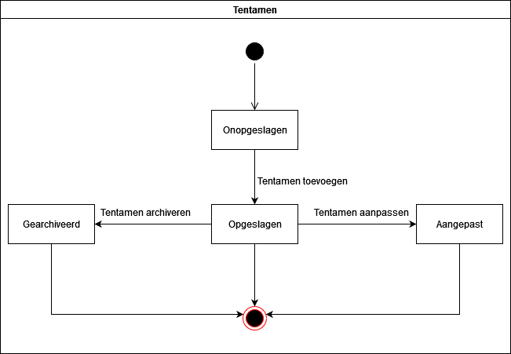
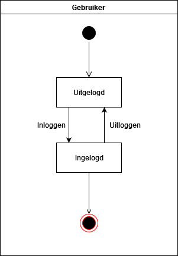
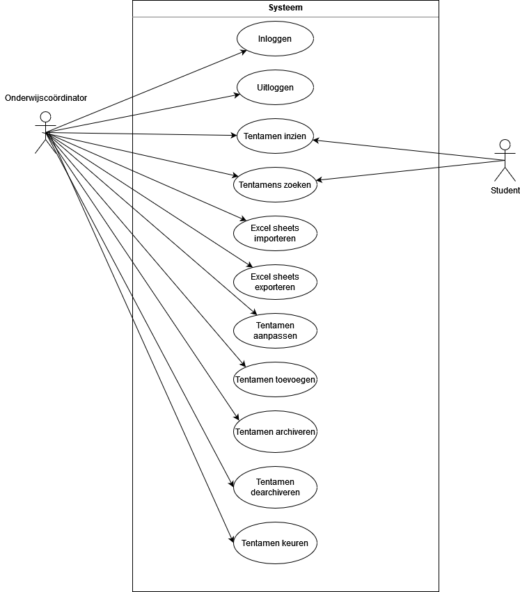
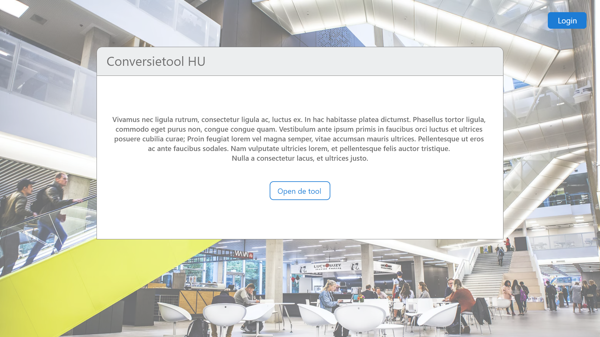
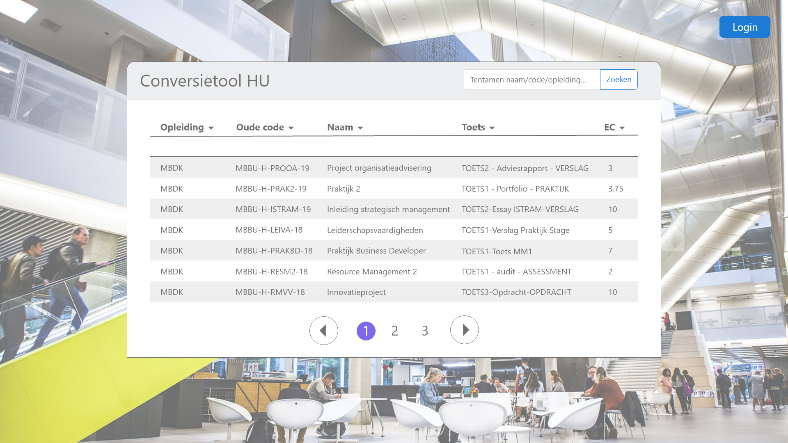
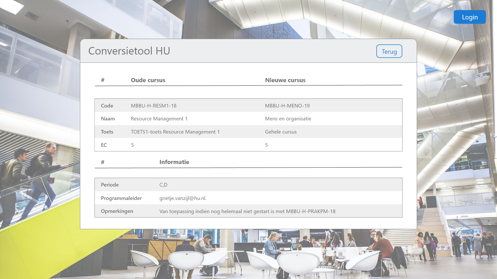
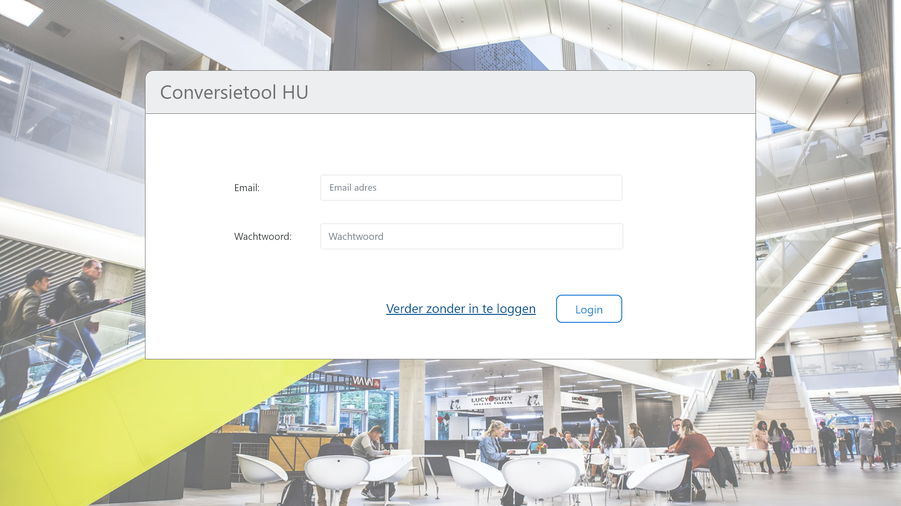
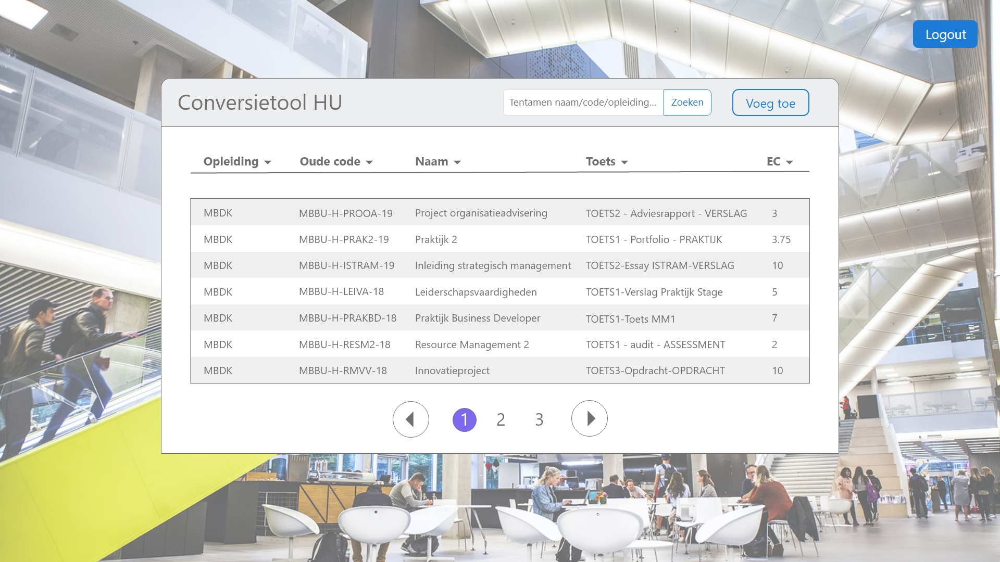

# Functioneel Ontwerp

# Domein model

## User stories
1. Als onderwijscoördinator wil ik een tentamen inzien zodat ik alle informatie heb over een tentamen
2. Als onderwijscoördinator wil ik zoeken op tentamens zodat ik weet om welk tentamen het gaat
3. Als student wil ik tentamens inzien zodat ik alle informatie heb over een tentamen
4. Als onderwijscoördinator wil ik uitloggen zodat ik niet meer gebruik kan maken van het systeem
5. Als onderwijscoördinator wil ik inloggen zodat ik gebruik kan maken van het systeem
6. Als onderwijscoördinator wil ik excel sheets exporteren zodat ik alle informatie uit de applicatie kan halen
7. Als onderwijscoördinator wil ik excel sheets importeren zodat studenten een overzicht krijgen te zien van hun tentamens
8. Als student wil ik zoeken op tentamens zodat ik weet om welk tentamen het gaat
9. Als onderwijscoördinator wil ik tentamens archiveren zodat overbodige tentamens niet meer zichtbaar zijn
10. Als onderwijscoördinator wil ik tentamens aanpassen zodat leerlingen hun nieuwe tentamens kunnen inzien
11. Als onderwijscoördinator wil ik tentamens toevoegen zodat leerlingen hun nieuwe tentamens kunnen inzien

# Klassen

## Tentamen

## Gebruiker

## Use case diagram

# Sitemap & Wireframes

[Interactieve wireframe](https://xd.adobe.com/view/ac25fdff-4805-466b-b034-09051dde8950-f976/?fullscreen)

## Uitgelogd

### Info pagina
Op deze pagina vind je een uitleg van de conversie tool.

### Home pagina
Op deze pagina zijn alle tentamens in te zien. Je kan gebruik maken van filters of zoeken op zoekwoorden om het gewenste tentamen te vinden.

### Tentamen pagina
Op deze pagina kan je alle details inzien van een tentamen.

## Ingelogd

### Login pagina
Op deze pagina kan je inloggen.

### Home pagina
Op deze pagina zijn alle tentamens in te zien. Je kan gebruik maken van filters of zoeken op zoekwoorden om het gewenste tentamen te vinden.

### Tentamen pagina
Op deze pagina kan je alle details inzien van een tentamen. Ook kan je hier een tentamen wijzigen of archiveren.

### Tentamen toevoegen
Op deze pagina kan je een tentamen toevoegen.

### Tentamen wijzigen
Op deze pagina kan je gegevens van een tentamen wijzigen.
