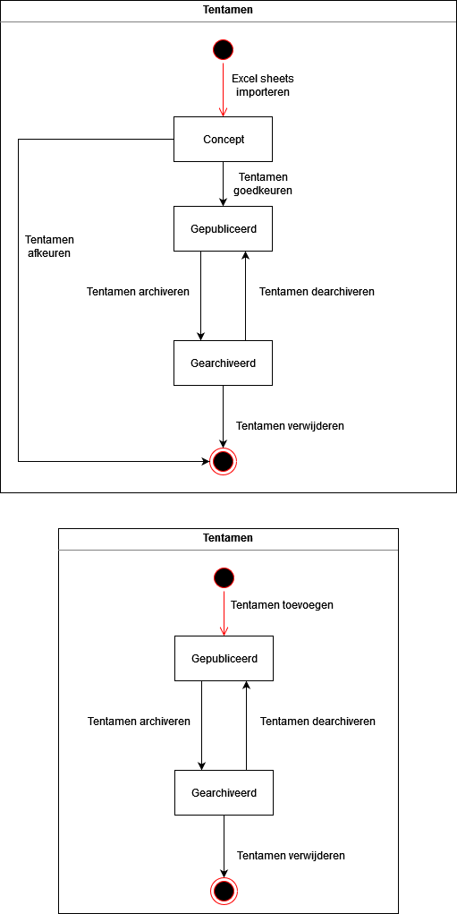

# Functioneel Ontwerp

# Domein model

## User stories
1. Als onderwijscoördinator wil ik tentamens toevoegen zodat leerlingen hun nieuwe tentamens kunnen inzien 
2. Als onderwijscoördinator wil ik tentamens aanpassen zodat leerlingen hun nieuwe tentamens kunnen inzien 
3. Als onderwijscoördinator wil ik tentamens archiveren zodat overbodige tentamens niet meer zichtbaar zijn 
4. Als student wil ik zoeken op tentamens zodat ik weet om welk tentamen het gaat 
5. Als onderwijscoördinator wil ik excel sheets importeren zodat studenten een overzicht krijgen te zien van hun tentamens 
6. Als onderwijscoördinator wil ik excel sheets exporteren zodat ik alle informatie uit de applicatie kan halen 
7. Als onderwijscoördinator wil ik inloggen zodat ik gebruik kan maken van het systeem 
8. Als onderwijscoördinator wil ik uitloggen zodat ik niet meer gebruik kan maken van het systeem 
9. Als student wil ik tentamens inzien zodat ik alle informatie heb over een tentamen 
10. Als onderwijscoördinator wil ik zoeken op tentamens zodat ik weet om welk tentamen het gaat 
11. Als onderwijscoördinator wil ik een tentamen inzien zodat ik alle informatie heb over een tentamen 
12. Als student wil ik een homepage zodat ik uitleg krijg over het systeem 
13. Als onderwijscoördinator wil ik een homepage zodat ik uitleg krijg over het systeem 
14. Als onderwijscoördinator wil ik een archief inzien van alle tentamens zodat ik een overzicht heb van alle gearchiveerde tentamens 
15. Als onderwijscoördinator wil ik gearchiveerde tentamens terug kunnen zetten zodat ik fouten terug kan zetten 
16. Als onderwijscoördinator wil ik meerdere tentamens in 1 keer kunnen beoordelen zodat ik niet handmatig door alles heen moet klikken

# Klassen

## Tentamen

## Gebruiker

## Use case diagram

# Sitemap & Wireframes

[Interactieve wireframe](https://xd.adobe.com/view/5d901b42-0872-49b4-97a5-0475071cdade-08c3/?fullscreen)

## Uitgelogd

### Info pagina
Op deze pagina vind je een uitleg van de conversie tool.

### Home pagina
Op deze pagina zijn alle tentamens in te zien. Je kan gebruik maken van filters of zoeken op zoekwoorden om het gewenste tentamen te vinden.

### Tentamen pagina
Op deze pagina kan je alle details inzien van een tentamen.

## Ingelogd

### Login pagina
Op deze pagina kan je inloggen.

### Home pagina
Op deze pagina zijn alle tentamens in te zien. Je kan gebruik maken van filters of zoeken op zoekwoorden om het gewenste tentamen te vinden.

### Tentamen pagina
Op deze pagina kan je alle details inzien van een tentamen. Ook kan je hier een tentamen wijzigen of archiveren.

### Tentamen toevoegen
Op deze pagina kan je een tentamen toevoegen.

### Tentamen wijzigen
Op deze pagina kan je gegevens van een tentamen wijzigen.

### Excel bestand importeren
Op deze pagina kan je een Excel bestand importeren

### Tentamens controleren
Op deze pagina kan je tentamens controleren die uit een import zijn gekomen

### Archief pagina
Op deze pagina kan je alle gearchiveerde tentamens inzien

### Gearchiveerd tentamen
Op deze pagina kan je de informatie van een gearchiveerd tentamen inzien

# Sitemap
